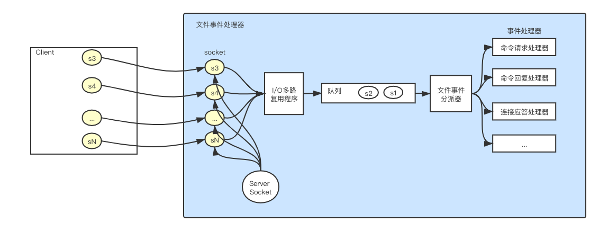
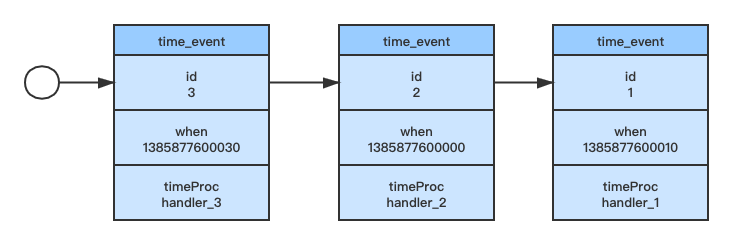

# 单线程模型

Redis通过基于**I/O多路复用**技术实现的文件事件处理器，使用**单线程单进程**方式处理命令请求，并与多个客户端进行网络通信。

Redis服务器是一个事件驱动程序，其中分为两种事件:  
1. 文件事件(file event): Redis服务器与客户端(或其他服务器)连接和通信产生的相关事件。Redis就是监听文件事件来完成相关操作。
2. 事件事件(time event): Redis服务器内部一些需要定点执行的操作(如serverCron)

### 文件事件处理器

#### 文件事件处理器的主要组成部分  

文件事件是对socket操作的抽象，socket执行连接应答、写入、读取、关闭等操作时，都会产生一个文件事件，文件事件可能会并发出现。  

#### 文件事件处理器的流程
1. 客户端创建socket
2. ServerSocket根据客户端的socket创建相应服务端socket, I/O多路复用程序监听这些socket，并将产生事件的socket都放到队列中
3. 队列以有序(sequentially)、同步(synchronously)、每次一个socket的方式向文件事件分派器传送socket。
当上一个socket产生的事件被所关联的事件处理器执行完毕后，才会向文件事件分派器传送下一个socket
4. 文件事件分派起根据socket产生的事件类型，调用相应事件处理器。服务器回味不同任务的socket关联不同的事件处理器(即一个个函数)

#### 事件的类型:  
AE_READABLE事件: 客户端对socket执行write/close操作，如命令set key value，则缠身对应的AE_READABLE事件
AE_WRITABLE事件: socket可写时产生AE_WRITABLE事，如命令get key

### 时间事件
所有的事件事件放在一个无序链表[^1]中，每当时间事件执行器运行时，遍历整个链表，查找已到达的时间时间，并调用相应的时间处理器。新加入的事件总是插到链表头。

如果一个事件是定时事件，到达一次后就会从链表中删除，如果是周期性事件，到达一次后，会重新计算下一个到达的事件并更新到when字段。

[^1]: 无序指的是不按照when属性进行排序。Redis版本只有1～2个时间事件，因此用无序链表并不会影响性能。