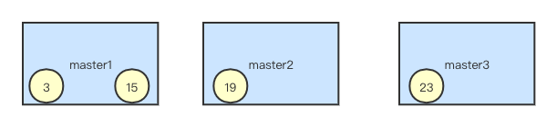
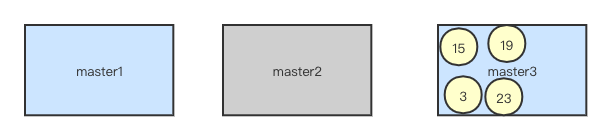
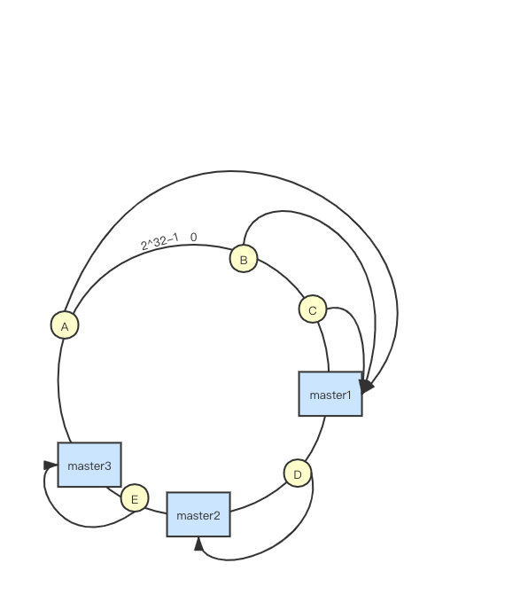
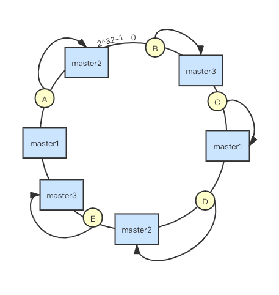

# 一致性hash

#### 普通hash算法  

假设有3个master节点，Redis中的数据对3取模来决定分到哪一个节点上。如图3, 15分到节点1，19分到节点2，23分到节点3。
假设某一时间master2下线，则新的请求将对2取模来查到数据如下:  

可见大多数请求都无法找到缓存所在的节点，造成缓存雪崩，大量请求直接访问数据库而造成系统崩溃。

普通hash算法除了无法应对节点失效的情况外，假设节点数量较少，如上述只有两三个节点，也会造成数据分布不均的问题。

#### 一致性hash算法
一致性hash算法假设有一个由2^32个节点组成的一个圆环，即hash环。而将服务器节点(比如ip或主机名)对2^32取模来发布到hash环上。
服务器存储的数据同样对2^32取模，数据落在顺时针方向最近的节点上。

如下图，数据ABC将会存在master1节点上，数据D存在master2节点，数据E存在master3节点  

这样当master2节点下线后，由于数据仍然对2^32取模，仅会影响数据D和节点master3。但仍然无法解决数据分布不均的问题。甚至极端情况下大多数数据可能分布在某一个节点上。

因此引入了虚拟节点的概念，假设一个实际的节点对应多个虚拟节点，而将这些虚拟节点分布在hash环上，虚拟节点数越多，数据分布当然也越均匀。  
引入虚拟节点后的hash环分布如下:  
