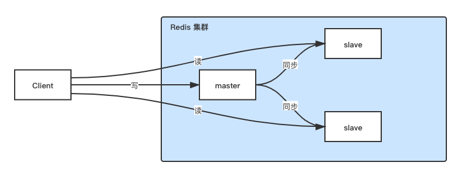

# 高并发与主从复制

单机Redis的QPS在上万～数万，很难达到10万+QPS，而多数系统是读多写少的系统，为了支持数千～数万的写QPS和数十万的读QPS，我们需要读写分离。
而Redis天然支持主从分离的架构。

#### 读写分离架构

如上图，客户端写(更新、删除、新增等)数据时只写master，而master负责将数据同步(异步地)给slave。读数据时只从slave读取。

这样做的好处是，当读QPS不断增高时，只需新增slave机器则可以扩展以适应更高的要求。

#### 复制
复制分成两种:  
1. 同步: 将从数据库更新至和主数据库一致
2. 命令传播: 主从已经一致的情况下，修改主数据库而导致的不一致，通过命令传播来使其一致

一个例子:

在2.8版本前，同步命令为SYNC，缺陷是主从同步完成后，如果服务器连接断开，需要发送一个完成的RDB文件重新同步。
而2.8版本后，使用了PSYNC命令代替SYNC，支持增量同步，连接断开后可以从上一次没有完成的地方重新发送命令。

Redis复制过程中，master仍然可以处理新的请求，slave会以旧的数据处理新的请求。

#### 增量同步
增量同步，指slave与master断线后，在条件允许的情况下，从上次中断的位置继续复制，而非从头开始复制。增量同步需要master和slave已经进行过一次全量同步。  

增量同步需要的三个条件: 
1. replication offset(复制偏移量)  
    master和slave都保存有replication offset，正常情况下，master往slave发送m字节的数据后，master和slave的offset都加m。而假如slave断开连接，则offset会落后于master。  
    假设一个场景，某一时刻offset如下  
      
    master发送33字节，而s1在之前刚好断开连接，则offset变更为下图  
      
    当s1重新连上master后，向master发送PSYNC命令并告知自身的offset，master收到命令后，**如果大于这个offset(即从offset+1开始)的数据均存在**，则采用增量同步的方式，将从offset+1开始往后的数据发送给s1，否则不得不使用完整重同步。
    而这一部分数据就存在replication backlog中。
    
2. replication backlog(复制积压缓冲区)
    replication backlog是一个固定大小(fixed-size)的FIFO队列。在master进行命令传播时，不仅会将命令发送给slave，同时会写入backlog。如果backlog的大小超过指定值后，先入队的字节会被删除。
    因此假如backlog过小，则无法支撑增量同步而不得不每次都全部重同步，增量同步也就没有意义了。  
    backlog的大小可以同过repl-backlog-size设置，可以根据second(slave重连需要的时间) * write_size_per_second(master每秒产生的写数据量)估算，保险起见可以设置为2倍的这个值。
    
3. run id(服务器运行id)
    服务器启动时都会生成一个40位随机运行ID，slave对master初次复制时，master会发送自己的run id，slave则保存起来。当断线重连时，slave会发送给master之前保存的run id，
    如果一致，说明是同一个master，可以尝试增量同步，否则需要完整重同步。
    
    master重启并不会导致run id变化，而master从rdb文件中恢复其他版本的数据，run id会发生变化。因此ip+port是无法判断出从逻辑上来说是否是同一个master的。
    
#### 数据丢失处理
数据丢失来源于两个方面:  
1. master是将命令异步同步给slave的，假设master宕机，来不及将命令同步给slave，在master恢复前，某个slave已经升级为master，则原先的master机器恢复后会从新的master同步数据，之前还未同步的命令就丢失了。
2. 脑裂导致的数据丢失

    

